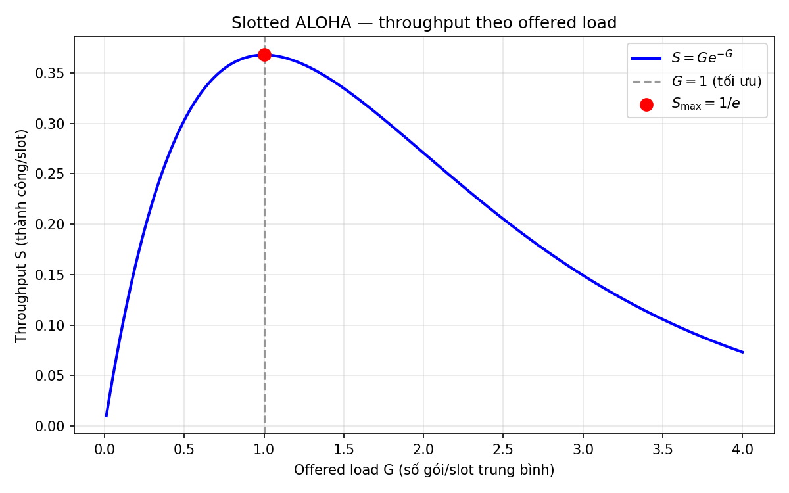
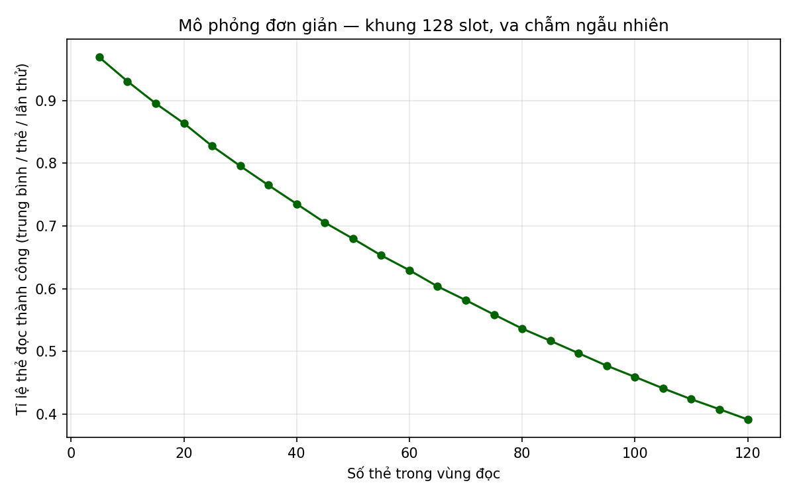
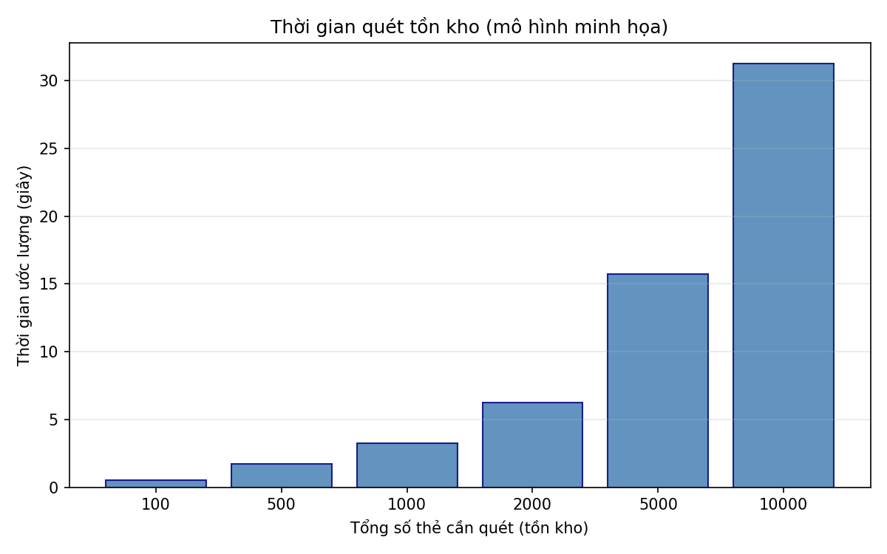

# Báo cáo mô phỏng RFID trong quản lý kho

---

## 1. Sơ lược lý thuyết

**RFID (Radio Frequency Identification)** cho phép nhận dạng thẻ không tiếp xúc nhờ trường điện từ giữa đầu đọc (reader) và thẻ (tag). Trong kho hàng, thẻ thường gắn pallet, thùng hoặc sản phẩm để quét nhanh tồn kho và luân chuyển hàng.

**Đặc điểm quan trọng khi nhiều thẻ trong vùng đọc:**

- **Va chạm (collision):** nhiều thẻ trả lời cùng lúc làm reader không phân tách được dữ liệu.
- **Chống va chạm (anti-collision):** các chuẩn (ví dụ EPC Gen2 UHF) dùng cơ chế lựa chọn thẻ theo từng vòng, chia khung thời gian (frame), hoặc thuật toán cây (tree).
- **Slotted ALOHA (lý thuyết cổ điển):** mỗi thẻ truyền trong một “slot” ngẫu nhiên; nếu hai thẻ cùng slot thì xảy ra va chạm. Với **offered load** \(G\) (trung bình số lần phát/slot), **throughput** thành công trên một slot là \(S = G e^{-G}\). Giá trị tối đa \(S_{\max} = 1/e\) khi \(G = 1\). Đây là mô hình tham chiếu để hiểu vì sao tải quá lớn hoặc quá nhiều thẻ đồng thời làm hiệu suất đọc giảm.

**Ứng dụng kho:** số thẻ trong vùng đọc tăng → va chạm tăng → cần nhiều vòng đọc hoặc điều chỉnh kích khung (frame size), ảnh hưởng thời gian quét toàn bộ tồn kho.

---

## 2. Mô phỏng bằng Python

### 2.1 Mã nguồn Python

Toàn bộ chương trình nằm trong file **`simulation_rfid_kho.py`** (cùng thư mục với báo cáo này).

Nội dung chính:

- Vẽ đồ thị **throughput \(S\)** theo **\(G\)** cho slotted ALOHA (công thức lý thuyết).
- Mô phỏng **đơn giản** tỉ lệ đọc thành công khi tăng số thẻ trong một khung có số slot cố định (minh họa xu hướng giảm hiệu quả khi quá tải).
- Vẽ **thời gian quét tồn kho** theo mô hình minh họa (số vòng × thời gian mỗi vòng).

**Chạy mô phỏng và sinh hình:**

```bash
cd docs
pip install numpy matplotlib
python simulation_rfid_kho.py
```

Hình PNG được lưu vào thư mục `docs/figures/`.

---

### 2.2 Đồ thị mô phỏng và nhận xét từng hình

#### Hình 1 — Throughput slotted ALOHA (`figures/hinh1_throughput_aloha.png`)



**Nhận xét hình 1:** Đường cong \(S = G e^{-G}\) cho thấy throughput tăng khi \(G\) từ 0 đến 1, sau đó giảm khi \(G > 1\) do va chạm chiếm ưu thế. Điểm cực đại tại \(G = 1\) với \(S \approx 0{,}368\) minh họa nguyên tắc “vừa đủ tải”: không nên cố nhồi quá nhiều phát trong một slot.

---

#### Hình 2 — Tỉ lệ đọc thành công theo số thẻ (`figures/hinh2_success_vs_tags.png`)



**Nhận xét hình 2:** Khi số thẻ trong vùng đọc tăng trong khi số slot khung cố định, xác suất nhiều thẻ chọn cùng slot tăng, nên tỉ lệ thành công (theo mô hình đơn giản trong code) có xu hướng giảm. Trong thực tế reader sẽ điều chỉnh frame size hoặc chia vùng đọc để duy trì hiệu suất.

---

#### Hình 3 — Thời gian quét tồn kho minh họa (`figures/hinh3_inventory_time.png`)



**Nhận xét hình 3:** Với giả định mỗi vòng chỉ xử lý hiệu quả một phần thẻ, tổng thời gian quét tăng khi tổng số thẻ tăng. Đây là mô hình minh họa (không thay thế đo thực tế), giúp hình dung nhu cầu tối ưu lịch quét và cấu hình reader trong kho lớn.

---

### 2.3 Nhận xét tổng thể

- **Lý thuyết ALOHA** cho khung nhìn định tính: quá tải làm giảm throughput; cần cân bằng tải và cơ chế chống va chạm.

- **Mô phỏng số** trong `simulation_rfid_kho.py` **đơn giản hóa** thực tế EPC Gen2 (không mô phỏng đầy đủ Q-algorithm, Select/Inventory). Mục đích là minh họa xu hướng, không thay thế benchmark thiết bị.

- **Hướng mở rộng:** thêm mô hình frame động theo chuẩn EPC, nhiễu kênh, hoặc dữ liệu đo thực từ cổng RFID trong kho để so sánh với đường cong lý thuyết.

---

*Tài liệu được tạo theo cấu trúc: (1) lý thuyết, (2) Python gồm mã, đồ thị có nhận xét từng hình, (3) nhận xét chung.*
